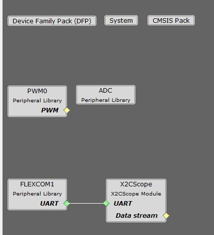

# PMSM FOC using PLL Estimator

This example application shows how to control the Permanent Magnet Synchronous Motor (PMSM) with PLL Estimator based Field Oriented Control (FOC) on a SAMRH707 Micro-controller. 

## Description

Permanent Magnet Synchronous Motor (PMSM) is controlled using Field Oriented Control (FOC). Rotor position and speed is determined using PLL estimator technique. Motor start/stop operation is controlled by the switch and motor speed can be changed by the on-board potentiometer. Waveforms and variables can be monitored runtime using X2CScope. 

Key features enabled in this project are:

- Dual shunt current measurement
- Speed control loop
- Field weakening

## MHC Project Configurations

- **ADC**: 

   ADC is hardware triggered from PWM at the end of each PWM cycle. It coverts phase U current, phase V current, DC bus voltage and potentiometer.

   Conversion Ready interrupt is generated by ADC. 

- **PWM0**: 

    This peripheral is used to generated three phase synchronous PWM waveforms. Fault functionality is also enabled to switch off the output waveforms asynchronously.

- **X2CScope**: 

    This component adds X2C scope protocol code. This uses UART to communicate to the host PC. X2CScope allows user to monitor variables runtime.
- **FLEXCOM1 Peripheral**: 

    The UART is used for X2CScope communication to observe graphs and variable values in run time 

## Project Details
For details refer [Motor Control](https://microchip-mplab-harmony.github.io/motor_control/algorithms/pmsm_foc/mc_plant_docs/introduction.md)

## Development Kits

### MCLV2 with ATSAMRH707 PIM
#### Downloading and building the application

To clone or download this application from Github, go to the [main page of this repository](https://github.com/Microchip-MPLAB-Harmony/mc_apps_sam_rh707) and then click **Clone** button to clone this repository or download as zip file.
This content can also be downloaded using content manager by following these [instructions](https://github.com/Microchip-MPLAB-Harmony/contentmanager/wiki).

Path of the application within the repository is **apps/pmsm_foc_pll_estimator_sam_rh707** .

To build the application, refer to the following table and open the project using its IDE.

| Project Name      | Description                                    | Demo User Guide |
| ----------------- | ---------------------------------------------- | -------------- |
| mclv2_sam_rh707_pim.X | MPLABX project for MCLV2 board with ATSAMRH707 PIM | [Hardware Setup and Running The Application on MCLV2 with ATSAMRH707 PIM](../docs/mclv2_atsamrh707_pim_sensorless.md) |
||||
